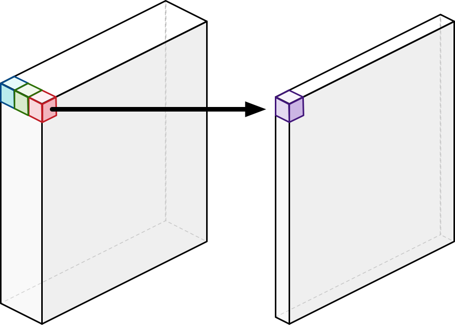
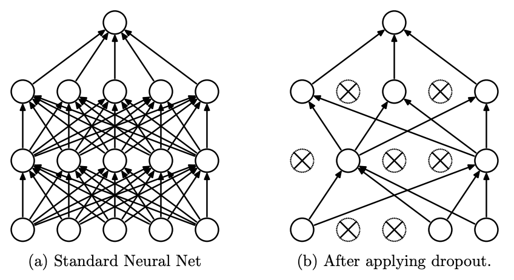

# ATCASR
Air Traffic Control - Automatic Speech Recognition - CS 674: Project 2
|Date|Time|Accomplished|
|---|---|---
3/16/22 | 11:00AM-12:30PM=**1.5hrs** | Began README, downloaded initial dataset, began looking for resources about the conformer architecture. Started implementing the <a href="https://paperswithcode.com/method/swish">Swish</a> activation function and the complete linear module.
3/16/22 | 8:30PM-9:45PM=**1.25hrs** | 
|**Total**|**2.75hrs**|

## Conformer Architecture
- SpecAug
- Conv Subsampling
- Linear
- [Dropout](#18-dropout-httpspaperswithcodecommethoddropout)
- *Conformer Block* x N

The *Conformer block* is made up of 3 modules [Convolution Module](#convolution-module), [MHSA Module](#multi-headed-self-attention-module), and [Feed Forward Module](#feed-forward-module):

### 1 Convolution Module
#### 1.1 Layernorm: https://paperswithcode.com/method/layer-normalization
```
"Unlike batch normalization, Layer Normalization directly 
estimates the normalization statistics from the summed 
inputs to the neurons within a hidden layer so the 
normalization does not introduce any new dependencies 
between training cases.
```


#### 1.2 Pointwise Conv
```
Pointwise convolution is convolution with a kernel size of 1x1. 
This preserves the height and width of the "image", but 
compresses the number of channels, into a form of encoding 
representing the 3 channels. 
```


#### 1.3 GLU Activation: https://paperswithcode.com/method/glu

#### 1.4 1D Depthwise Conv: https://paperswithcode.com/method/depthwise-convolution
```
A type of convolution where we apply a single convolutional
filter for each input channel. In the regular 2D convolution 
performed over multiple input channels, the filter is as deep 
as the input and lets us freely mix channels to generate each 
element in the output. In contrast, depthwise convolutions 
keep each channel separate.
```

```python
# Read about this implementation here: https://discuss.pytorch.org/t/how-to-modify-a-conv2d-to-depthwise-separable-convolution/15843/6
self.depthwise = nn.Conv2d(nin, nin, kernel_size=3, padding=1, groups=nin)
self.pointwise = nn.Conv2d(nin, nout, kernel_size=1)
```


#### 1.5 BatchNorm: https://paperswithcode.com/method/batch-normalization
```
"Aims to reduce internal covariate shift, and in doing so aims 
to accelerate the training of deep neural nets. It accomplishes 
this via a normalization step that fixes the means and variances 
of layer inputs. Batch Normalization also has a beneficial effect 
on the gradient flow through the network, by reducing the 
dependence of gradients on the scale of the parameters or of their 
initial values. This allows for use of much higher learning rates 
without the risk of divergence. Furthermore, batch normalization 
regularizes the model and reduces the need for Dropout."
```


#### 1.6 Swish Activation: https://paperswithcode.com/method/swish
```
"Swish is an activation function, f(x) = x • sigmoid(ßx), 
where ß a learnable parameter. Nearly all implementations 
do not use the learnable parameter ß, in which case the 
activation function is xσ(x) ("Swish-1").


The function xσ(x) is exactly the SiLU, which was 
introduced by other authors before the swish."
```    

- **1.7 [Pointwise Conv](#pointwise-conv)**

#### 1.8 Dropout: https://paperswithcode.com/method/dropout
```
"Dropout is a regularization technique for neural networks 
that drops a unit (along with connections) at training time 
with a specified probability p (a common values is p=0.5). 
At test time, all units are present, but with weights 
scaled by p (i.e. w becomes pw).

The idea is to prevent co-adaptation, where the neural 
network becomes too reliant on particular connections, 
as this could be symptomatic of overfitting. Intuitively, 
dropout can be thought of as creating an implicit ensemble 
of neural networks."
```


- **1.9 Residual with input**

### 2 Multi-Headed Self-Attention Module

- **2.1 [Layernorm](#layernorm-httpspaperswithcodecommethodlayer-normalization)**

#### 2.2 Multi-Head Self-Attention with Relative Positional Embedding
    The standard MHA from the *"Attention is all you need"* paper. 
    I believe that the first instance of attention in both encoder 
    and decoder are self-attention. If so, I will use this attention 
    declaration.
```python
class MultiHeadedAttention(nn.Module):
    def __init__(self, h, d_model, dropout=0.1):
        "Take in model size and number of heads."
        super(MultiHeadedAttention, self).__init__()
        assert d_model % h == 0
        # We assume d_v always equals d_k
        self.d_k = d_model // h
        self.h = h
        self.linears = clones(nn.Linear(d_model, d_model), 4)
        self.attn = None
        self.dropout = nn.Dropout(p=dropout)
        
    def forward(self, query, key, value, mask=None):
        "Implements Figure 2"
        if mask is not None:
            # Same mask applied to all h heads.
            mask = mask.unsqueeze(1)
        nbatches = query.size(0)
        
        # 1) Do all the linear projections in batch from d_model => h x d_k 
        query, key, value = \
            [l(x).view(nbatches, -1, self.h, self.d_k).transpose(1, 2)
             for l, x in zip(self.linears, (query, key, value))]
        
        # 2) Apply attention on all the projected vectors in batch. 
        x, self.attn = attention(query, key, value, mask=mask, 
                                 dropout=self.dropout)
        
        # 3) "Concat" using a view and apply a final linear. 
        x = x.transpose(1, 2).contiguous() \
             .view(nbatches, -1, self.h * self.d_k)
        return self.linears[-1](x)
```

Another version of MHSA that I found online here: https://github.com/The-AI-Summer/self-attention-cv/blob/main/self_attention_cv/transformer_vanilla/mhsa.py
```python
import numpy as np
import torch
from einops import rearrange
from torch import nn


def compute_mhsa(q, k, v, scale_factor=1, mask=None):
    # resulted shape will be: [batch, heads, tokens, tokens]
    scaled_dot_prod = torch.einsum('... i d , ... j d -> ... i j', q, k) * scale_factor

    if mask is not None:
        assert mask.shape == scaled_dot_prod.shape[2:]
        scaled_dot_prod = scaled_dot_prod.masked_fill(mask, -np.inf)

    attention = torch.softmax(scaled_dot_prod, dim=-1)
    # calc result per head
    return torch.einsum('... i j , ... j d -> ... i d', attention, v)


class MultiHeadSelfAttention(nn.Module):
    def __init__(self, dim, heads=8, dim_head=None):
        """
        Implementation of multi-head attention layer of the original transformer model.
        einsum and einops.rearrange is used whenever possible
        Args:
            dim: token's dimension, i.e. word embedding vector size
            heads: the number of distinct representations to learn
            dim_head: the dim of the head. In general dim_head<dim.
            However, it may not necessary be (dim/heads)
        """
        super().__init__()
        self.dim_head = (int(dim / heads)) if dim_head is None else dim_head
        _dim = self.dim_head * heads
        self.heads = heads
        self.to_qvk = nn.Linear(dim, _dim * 3, bias=False)
        self.W_0 = nn.Linear(_dim, dim, bias=False)
        self.scale_factor = self.dim_head ** -0.5

    def forward(self, x, mask=None):
        assert x.dim() == 3
        qkv = self.to_qvk(x)  # [batch, tokens, dim*3*heads ]

        # decomposition to q,v,k and cast to tuple
        # the resulted shape before casting to tuple will be: [3, batch, heads, tokens, dim_head]
        q, k, v = tuple(rearrange(qkv, 'b t (d k h ) -> k b h t d ', k=3, h=self.heads))

        out = compute_mhsa(q, k, v, mask=mask, scale_factor=self.scale_factor)

        # re-compose: merge heads with dim_head
        out = rearrange(out, "b h t d -> b t (h d)")
        # Apply final linear transformation layer
        return self.W_0(out)
```

- **2.3 [Dropout](#dropout-httpspaperswithcodecommethoddropout)**
- **2.4 residual with input**

### 3 Feed Forward Module
- **3.1 [Layernorm](#layernorm-httpspaperswithcodecommethodlayer-normalization)**
- **3.2 Linear Layer**
- **3.3 [Swish Activation](#swish-activation-httpspaperswithcodecommethodswish)**
- **3.4 [Dropout](#dropout-httpspaperswithcodecommethoddropout)**
- **3.5 Linear Layer**
- **3.6 [Dropout](#dropout-httpspaperswithcodecommethoddropout)**
- **3.7 Residual with input**


## Helpful Links
- Conformer: https://arxiv.org/pdf/2005.08100v1.pdf
- Efficient Conformer: https://arxiv.org/pdf/2109.01163.pdf
- Dataset: https://www.spsc.tugraz.at/databases-and-tools/atcosim-air-traffic-control-simulation-speech-corpus.html

## References
```bibtex
@misc{https://doi.org/10.48550/arxiv.2005.08100,
  doi = {10.48550/ARXIV.2005.08100},
  url = {https://arxiv.org/abs/2005.08100},
  author = {Gulati, Anmol and Qin, James and Chiu, Chung-Cheng and Parmar, Niki and Zhang, Yu and Yu, Jiahui and Han, Wei and Wang, Shibo and Zhang, Zhengdong and Wu, Yonghui and Pang, Ruoming},
  keywords = {Audio and Speech Processing (eess.AS), Machine Learning (cs.LG), Sound (cs.SD), FOS: Electrical engineering, electronic engineering, information engineering, FOS: Electrical engineering, electronic engineering, information engineering, FOS: Computer and information sciences, FOS: Computer and information sciences},
  title = {Conformer: Convolution-augmented Transformer for Speech Recognition},
  publisher = {arXiv},
  year = {2020},
  copyright = {arXiv.org perpetual, non-exclusive license}
}
```

```bibtex
@inproceedings{hofbauer2008atcosim,
  title={The ATCOSIM Corpus of Non-Prompted Clean Air Traffic Control Speech.},
  author={Hofbauer, Konrad and Petrik, Stefan and Hering, Horst},
  booktitle={LREC},
  year={2008},
  organization={Citeseer}
}
```

```bibtex
@misc{https://doi.org/10.48550/arxiv.1606.08415,
  doi = {10.48550/ARXIV.1606.08415},
  url = {https://arxiv.org/abs/1606.08415},
  author = {Hendrycks, Dan and Gimpel, Kevin},
  keywords = {Machine Learning (cs.LG), FOS: Computer and information sciences, FOS: Computer and information sciences},
  title = {Gaussian Error Linear Units (GELUs)},
  publisher = {arXiv},
  year = {2016},
  copyright = {arXiv.org perpetual, non-exclusive license}
}
```
